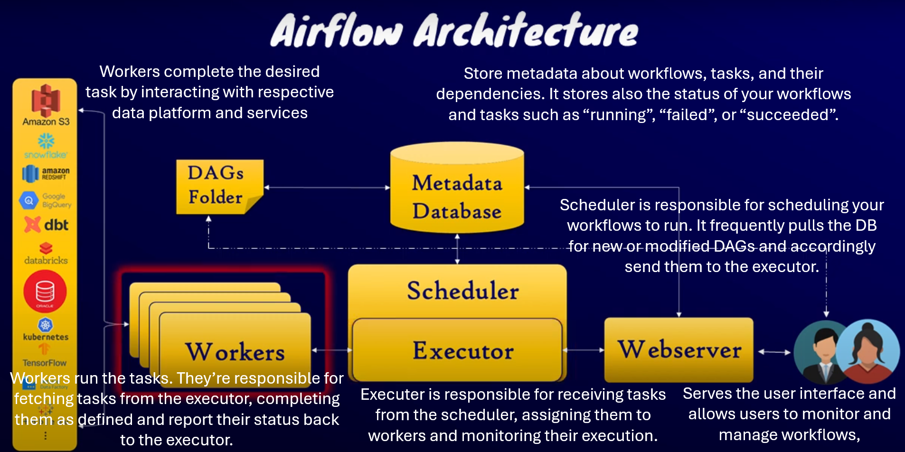
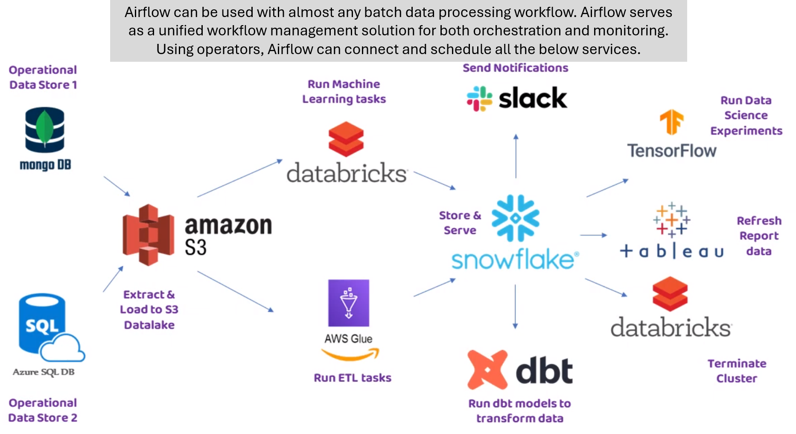

# 1. Apache Airflow
## 1.1. What is Apache Airflow?

Apache Airflow is a tool that helps automate tasks by organizing and scheduling them. It allows you to plan and execute tasks automatically according to a specific order.

## 1.2. DAGs

DAGs (Directed Acyclic Graphs) in Apache Airflow represent the tasks and their order of execution. Think of it as drawing a line from one point to another on a whiteboard, where each point represents a task.

## 1.3. Operators

Operators in Apache Airflow are special tools used to perform different tasks. They are like superpowers that allow you to accomplish specific actions. For example, there are operators for sending emails, running commands, and more.
So, a task is created by using an operator and an operator is an abstraction that defines what has to be done in a task.

## 1.4. Dependencies

Tasks are connected by dependencies indicating the order in which they should be executed.

## 1.5. DAG schedule

It specifies when the DAG should be executed.

## 1.6. Connectors to connect Apache Airflow to Cloud services: AWS, GCP, Azure

Apache Airflow can connect to cloud services like AWS, GCP, and Azure using connectors or hooks. These connectors are pieces of code that enable Airflow to communicate with the cloud services. By establishing connections and providing the necessary credentials, Airflow can interact with the cloud services and execute tasks on them.

## 1.7. Summary




### 1.7.1. Overview
* L'orchestration est le processus de gestion et de coordination de différentes tâches ou opérations pour atteindre un objectif commun. Cela implique de planifier, de synchroniser et de contrôler les différentes étapes d'un flux de travail.

* Un batch data processing workflow est un flux de travail où les données sont traitées en lots, c'est-à-dire en groupes. Cela signifie que les données sont collectées, stockées et traitées en tant qu'ensembles, plutôt que d'être traitées au fur et à mesure de leur arrivée.

* MongoDB, Azure SQL, Amazon S3, Databricks et Slack sont tous des outils ou des services utilisés dans le domaine de l'informatique et de la gestion des données.

> * MongoDB est une base de données NoSQL qui permet de stocker et de gérer des données de manière flexible et évolutive.

> * Azure SQL est un service de base de données relationnelle fourni par Microsoft Azure, qui permet de stocker et de gérer des données structurées selon le modèle relationnel.

> * Amazon S3 (Simple Storage Service) est un service de stockage d'objets dans le cloud fourni par Amazon Web Services (AWS). Il permet de stocker et de récupérer des données de manière sécurisée et évolutive.

> * Databricks est une plateforme d'analyse de données basée sur le cloud qui permet d'exécuter des tâches de traitement et d'analyse de données à grande échelle.

> * Slack est une plateforme de communication d'équipe qui permet aux membres d'une équipe de collaborer, de communiquer et de partager des informations.

En ce qui concerne leur position dans tout cela, ces outils peuvent être utilisés dans le cadre d'un flux de travail d'orchestration et de traitement de données.

### 1.7.2. How concretetly airflow manage all these services?

Apache Airflow joue un rôle essentiel dans l'orchestration et l'automatisation des flux de travail impliquant ces outils et services. Voici comment Airflow est lié à ces différents éléments :

* Airflow permet de définir et de planifier les tâches à exécuter dans un flux de travail. Il utilise les DAGs (Directed Acyclic Graphs) pour représenter les dépendances entre les tâches et déterminer l'ordre d'exécution.

* Les opérateurs d'Airflow fournissent des interfaces pour interagir avec les différents outils et services. Par exemple, il existe des opérateurs spécifiques pour exécuter des tâches sur les bases de données MongoDB et Azure SQL, pour transférer des fichiers vers et depuis Amazon S3, et pour exécuter des tâches sur la plateforme Databricks.

* Airflow intègre également des connecteurs spécifiques pour se connecter aux services cloud, tels que les connecteurs AWS, GCP et Azure. Ces connecteurs permettent à Airflow d'interagir avec les services cloud, comme exécuter des tâches sur des instances AWS, lire et écrire des données dans des services de stockage cloud, ou déclencher des processus dans des services de calcul cloud.

En utilisant Airflow, tu peux donc orchestrer et automatiser des flux de travail qui impliquent MongoDB, Azure SQL, Amazon S3, Databricks, Slack, et bien d'autres outils et services. Airflow te permet de planifier et d'exécuter ces tâches de manière cohérente, dans le bon ordre et en gérant les dépendances entre elles. Cela facilite l'automatisation des processus de traitement des données et la coordination des différentes étapes d'un flux de travail complexe.

# 2. Installation using Docker

* Step 1: Download and install Docker

* Step 2: Download and install VS Code

* Step 3: Create a directory to contain all your airflow projects
Named: ProjectAirflow

* Step 4: Open VS Code in this directory
In ProjectAirflow > Open your cmd Terminal > code .

* Step 5: In VS Code, install Docker extension and also Python extension

* Step 6: Create a dockerfile at the root of your ProjectAirflow directory
This is to build an image that will use airflow as base image.
This is to run a container and bind its port to one of our local port in order to access the airflow UI.

In the dockerfile:
```
FROM apache/airflow:latest

USER root
RUN apt-get update && \
    apt-get clean

USER airflow
```

Then, save the file.

* Step 7: right-clik on the dockerfile and click-on build image > give a name and enter
ImageName: let's say avad-airflow:latest

A the end (installation is finished), tap enter in the terminal to exit and close the terminal.

OR
Open your terminal, change the directory to achieve the dockerfile > execute this:
docker build -t avad-airflow .
(For this to work, you should start the docker destop app)

* Step 8: create a docker-compose file at the root of the d=ProjectAirflow to configure our airflow image

In this, we will do two things:
> * Expose port 8080 on which airflow runs to our localhost network traffic port 8080
> * For data persistency, we will create a volume to store data locally and bind the stored local db to a folder in our container

In the docker-compose file (extensioin: .yml):
```
version: '3'
services:
  avad-airflow-container:  // the container name
    image: avad-airflow:latest  // the built image

    volumes:
      - ./airflow:/opt/airflow  // bind the local ./airflow dir to the container dir /opt/airflow. This allow to persist our previous works (dags)

    ports:
      // never forget space between "-" and "8080-8080" for example
      - "8080:8080"  // expose port 8080 of the container to port 8080 of localhost. This allows to access the airflow UI from our host machine through the web browser

    command: airflow standalone  // this initiate all the airflow components including scheduler, workers, executer, web server...
```

Save the file.

* Step 9: righ-click on the docker-compose file and choose compose-up

OR (using the cmd line)
docker compose up
(be sure that docker desktop is running)

Then, type inside the terminal (in vs code) and press "Enter" to close the terminal.

We can verify in docker desktop that we now have a container running.
You can also see it, using the terminal (cmd) and type:
docker ps

* Step 10: go to your browser and type:
localhost:8080, you will access to the login page of airflow.

Your authentification information by default are:
username: admin
password: find it in the newly created airflow directory in your ProjectAirflow dir > In file standalone_admin_password.txt

And all works perfectly !!!

